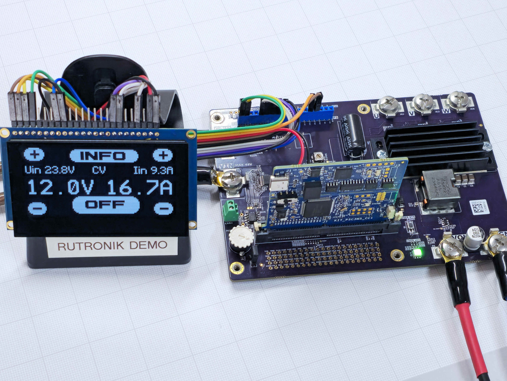
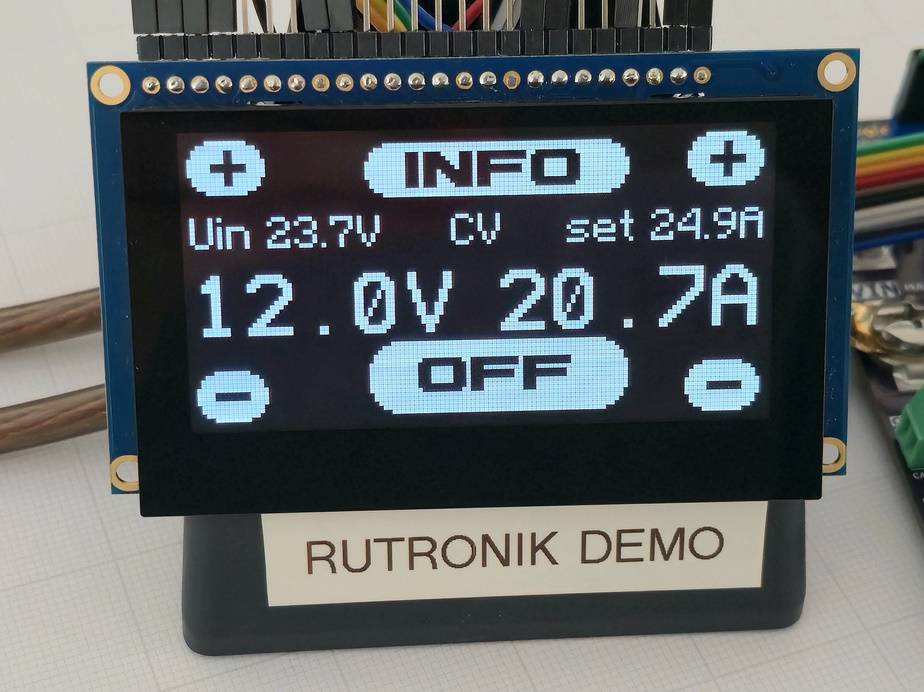
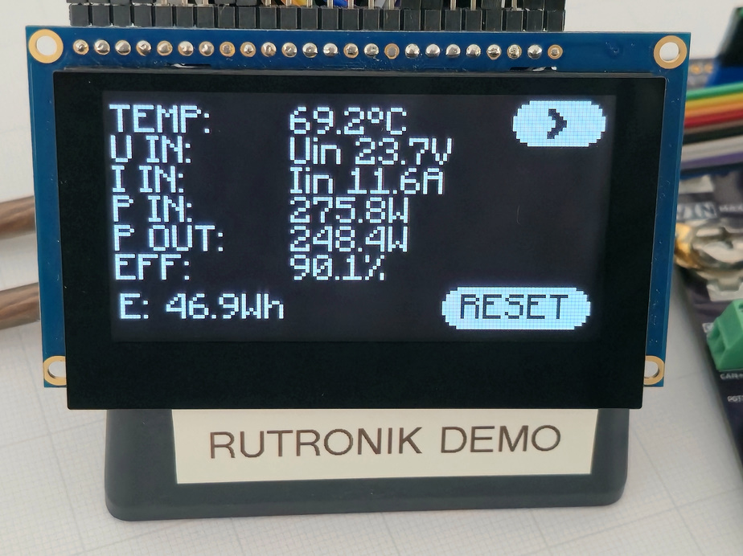
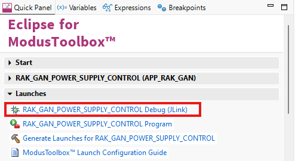

# RAK-GAN DC Power Supply Application

The DC Power Supply application features adjustable voltage and current outputs, controlled via a touch-capable OLED screen.

 

## Requirements

- [ModusToolbox® software](https://www.infineon.com/cms/en/design-support/tools/sdk/modustoolbox-software/) v3.7 or later (tested with v3.7)
- The EEZ-Studio for GUI creation
- The latest hardware release: RAK-GAN Rev. 1.
- REP012864Q-CTP screen from RAYSTAR.
- DC Power Supply.
- At least 2.5 mm2 (14 AWG) Power Cables.

## Supported toolchains (make variable 'TOOLCHAIN')

- GNU Arm&reg; Embedded Compiler v14.2.1 (`GCC_ARM`) - Default value of `TOOLCHAIN`

## Using the code example

Create the project and open it using one of the following:

<b>In Eclipse IDE for ModusToolbox&trade; software</b>

1. Click the **New Application** link in the **Quick Panel** (or, use **File** > **New** > **ModusToolbox&trade; Application**). This launches the [Project Creator](https://www.infineon.com/ModusToolboxProjectCreator) tool.

2. Pick a kit supported by the code example from the list shown in the **Project Creator - Choose Board Support Package (BSP)** dialogue.

   When you select a supported kit, the example is reconfigured automatically to work with the kit. To work with a different supported kit later, use the [Library Manager](https://www.infineon.com/ModusToolboxLibraryManager) to choose the BSP for the supported kit. You can use the Library Manager to select or update the BSP and firmware libraries used in this application. To access the Library Manager, click the link from the **Quick Panel**.

   You can also just start the application creation process again and select a different kit.

   If you want to use the application for a kit not listed here, you may need to update the source files. If the kit does not have the required resources, the application may not work.

3. In the **Project Creator - Select Application** dialogue, choose the example by enabling the checkbox.

4. (Optional) Change the suggested **New Application Name**.

5. The **Application(s) Root Path** defaults to the Eclipse workspace which is usually the desired location for the application. If you want to store the application in a different location, you can change the *Application(s) Root Path* value. Applications that share libraries should be in the same root path.

6. Click **Create** to complete the application creation process.

For more details, see the [Eclipse IDE for ModusToolbox&trade; software user guide](https://www.infineon.com/MTBEclipseIDEUserGuide) (locally available at *{ModusToolbox&trade; software install directory}/docs_{version}/mt_ide_user_guide.pdf*).

### Operation

This is a practical implementation of a DC power supply with an OLED user GUI. The output voltage can be adjusted from 2.5V to the near input voltage level, and what is crucial for such an application is an adjustable current limit. Once the current reaches the set limit, the power supply mode switches from CV (constant voltage) to CC (constant current) and maintains the current within the selected limits. 

The voltage control loop is implemented using the CMSIS PID controller.  LVGL is used for graphics. 

The basic information is shown on the main screen:

The additional parameters can be observed on the properties screen:

### Debugging

If you have successfully imported the example, the debug configurations are already prepared to use with the JLink. Open the ModusToolbox™ perspective and find the Quick Panel. Click the desired debug launch configuration, then wait for programming to complete and debugging to start.

WARNING: It is not recommended to start debugging while the buck converter is in operation. Always switch off the input power supply before programming the target. Once the debugger is ready, turn on the power supply and debug the application as usual. 

## Legal Disclaimer

The evaluation board including the software is for testing purposes only and, because it has limited functions and limited resilience, is not suitable for permanent use under real conditions. If the evaluation board is nevertheless used under real conditions, this is done at one’s responsibility; any liability of Rutronik is insofar excluded. 

